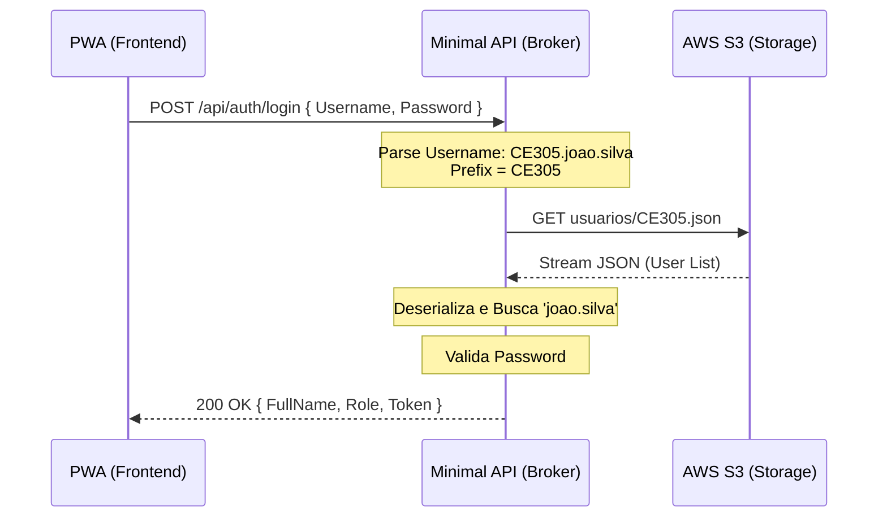

# Arquitetura do Backend (Authentication Broker)

Este documento descreve a arquitetura do serviço de autenticação implementado na Minimal API.

## Visão Geral

O sistema atua como um **Broker de Autenticação**. Em vez de manter um banco de dados centralizado de usuários, ele delega o armazenamento para repositórios JSON individuais hospedados no AWS S3, organizados por prefixos (geralmente representando prefeituras ou unidades gestoras).

## Fluxo de Autenticação

## Estrutura de Dados (S3)

Os arquivos devem estar localizados no bucket configurado sob o path:
`usuarios/{PREFIXO}.json`

### Exemplo de Path
`usuarios/CE305.json`

## Segurança (MVP)

> [!IMPORTANT]
> Para esta fase de MVP, as senhas estão sendo comparadas em texto plano. Em versões futuras, recomenda-se a implementação de hashing (BCrypt/Argon2) e o uso de JWT para tokens de sessão.
