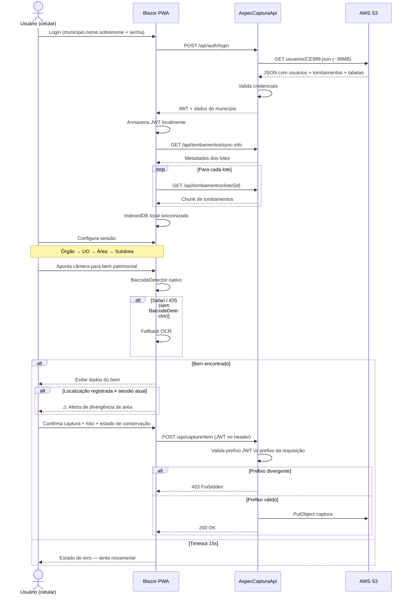
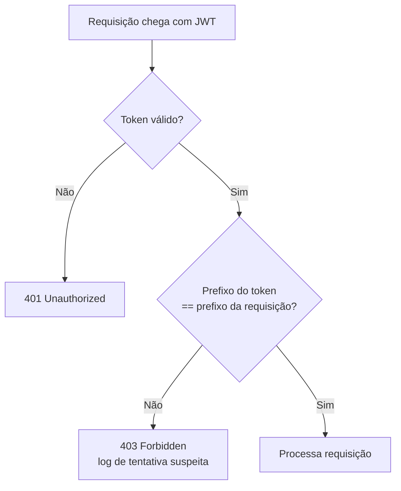
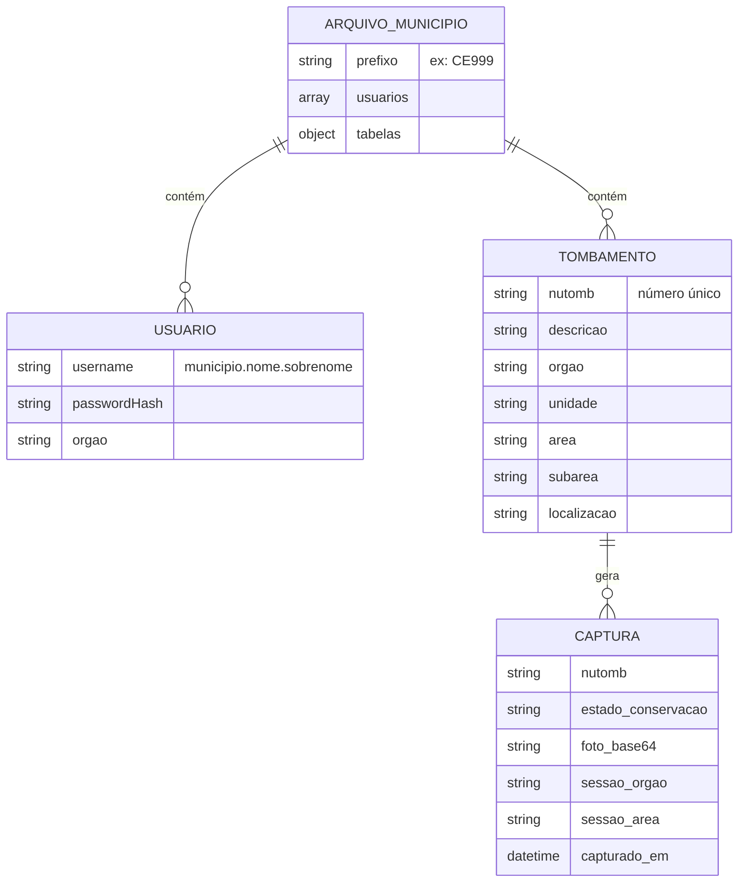

# Arquitetura — Aspec Captura (visão geral)

## Fluxo principal: Login → Sync → Scan → Captura

```mermaid
sequenceDiagram
    actor U as Usuário (celular)
    participant F as Blazor PWA
    participant A as AspecCapturaApi
    participant S as AWS S3

    U->>F: Login (municipio.nome.sobrenome + senha)
    F->>A: POST /api/auth/login
    A->>S: GET usuarios/CE999.json (~36MB)
    S-->>A: JSON com usuários + tombamentos + tabelas
    A->>A: Valida credenciais
    A-->>F: JWT + dados do município
    
    F->>F: Armazena JWT localmente
    F->>A: GET /api/tombamentos/sync-info
    A-->>F: Metadados dos lotes
    loop Para cada lote
        F->>A: GET /api/tombamentos/lote/{id}
        A-->>F: Chunk de tombamentos
    end
    F->>F: IndexedDB local sincronizado

    U->>F: Configura sessão
    Note over U,F: Órgão → UO → Área → Subárea

    U->>F: Aponta câmera para bem patrimonial
    F->>F: BarcodeDetector nativo
    alt Safari / iOS (sem BarcodeDetector)
        F->>F: Fallback OCR
    end

    alt Bem encontrado
        F-->>U: Exibe dados do bem
        alt Localização registrada ≠ sessão atual
            F-->>U: ⚠️ Alerta de divergência de área
        end
        U->>F: Confirma captura + foto + estado de conservação
        F->>A: POST /api/capture/item (JWT no header)
        A->>A: Valida prefixo JWT vs prefixo da requisição
        alt Prefixo divergente
            A-->>F: 403 Forbidden
        else Prefixo válido
            A->>S: PutObject captura
            A-->>F: 200 OK
        end
    else Timeout 15s
        F-->>U: Estado de erro — tente novamente
    end
```

---

## Validação de segurança por prefixo JWT

```mermaid
flowchart TD
    R[Requisição chega com JWT] --> D{Token válido?}
    D -- Não --> E1[401 Unauthorized]
    D -- Sim --> P{Prefixo do token\n== prefixo da requisição?}
    P -- Não --> E2[403 Forbidden\nlog de tentativa suspeita]
    P -- Sim --> OK[Processa requisição]
```

---

## Estrutura de dados no S3

```mermaid
erDiagram
    ARQUIVO_MUNICIPIO {
        string prefixo "ex: CE999"
        array usuarios
        object tabelas
    }
    USUARIO {
        string username "municipio.nome.sobrenome"
        string passwordHash
        string orgao
    }
    TOMBAMENTO {
        string nutomb "número único"
        string descricao
        string orgao
        string unidade
        string area
        string subarea
        string localizacao
    }
    CAPTURA {
        string nutomb
        string estado_conservacao
        string foto_base64
        string sessao_orgao
        string sessao_area
        datetime capturado_em
    }
    ARQUIVO_MUNICIPIO ||--o{ USUARIO : contém
    ARQUIVO_MUNICIPIO ||--o{ TOMBAMENTO : contém
    TOMBAMENTO ||--o{ CAPTURA : gera
```
